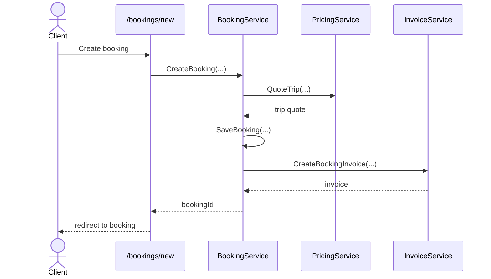
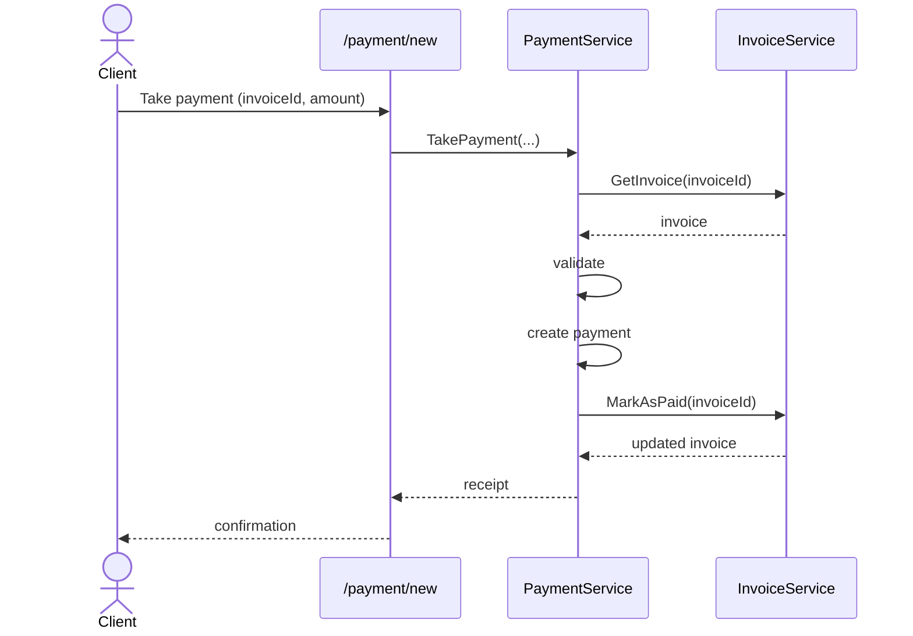
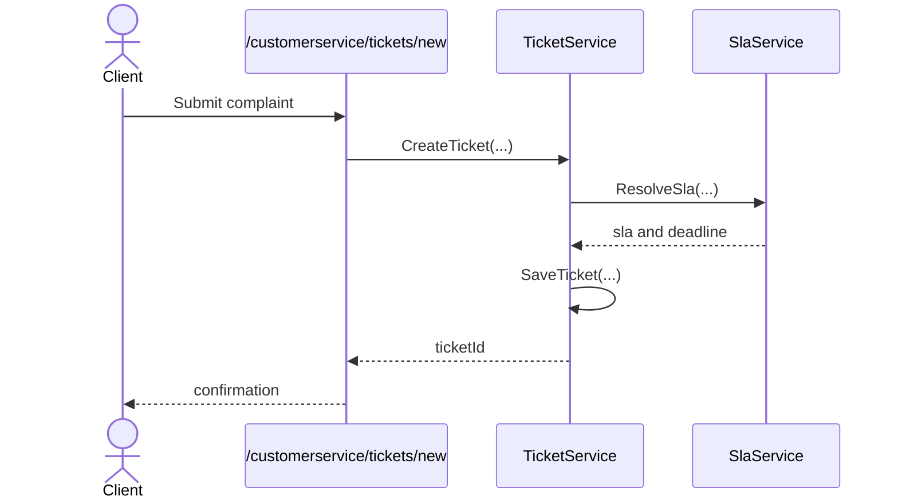
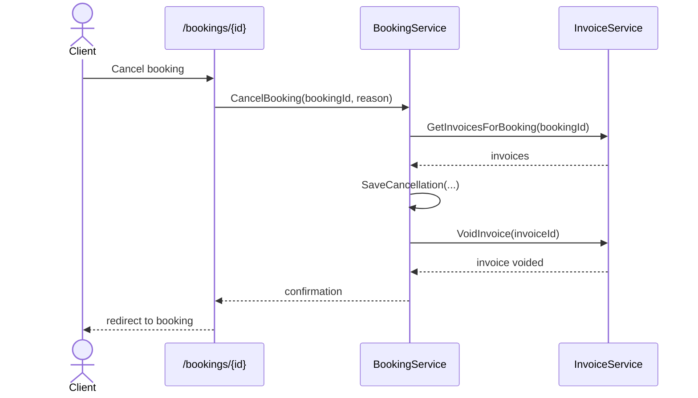

# Backend Wireframe

## Create booking happyflow

```mermaid
sequenceDiagram
  actor C as Client
  participant P as /bookings/new
  participant B as BookingService
  participant Pr as PricingService
  participant I as InvoiceService
  C->>P: Create booking
  P->>B: CreateBooking(...)
  B->>Pr: QuoteTrip(...)
  Pr-->>B: trip quote
  B->>B: SaveBooking(...)
  B->>I: CreateBookingInvoice(...)
  I-->>B: invoice
  B-->>P: bookingId
  P-->>C: redirect to booking
```

## Take payment happyflow

```mermaid
sequenceDiagram
  actor C as Client
  participant E as /payment/new
  participant P as PaymentService
  participant I as InvoiceService
  C->>E: Take payment (invoiceId, amount)
  E->>P: TakePayment(...)
  P->>I: GetInvoice(invoiceId)
  I-->>P: invoice
  P->>P: validate
  P->>P: create payment
  P->>I: MarkAsPaid(invoiceId)
  I-->>P: updated invoice
  P-->>E: receipt
  E-->>C: confirmation
```

## Ticket & SLA happyflow

```mermaid
sequenceDiagram
  actor C as Client
  participant P as /customerservice/tickets/new
  participant T as TicketService
  participant S as SlaService
  C->>P: Submit complaint
  P->>T: CreateTicket(...)
  T->>S: ResolveSla(...)
  S-->>T: sla and deadline
  T->>T: SaveTicket(...)
  T-->>P: ticketId
  P-->>C: confirmation
```

## Cancel booking happyflow

```mermaid
sequenceDiagram
  actor C as Client
  participant P as /bookings/{id}
  participant B as BookingService
  participant I as InvoiceService
  C->>P: Cancel booking
  P->>B: CancelBooking(bookingId, reason)
  B->>I: GetInvoicesForBooking(bookingId)
  I-->>B: invoices
  B->>B: SaveCancellation(...)
  B->>I: VoidInvoice(invoiceId)
  I-->>B: invoice voided
  B-->>P: confirmation
  P-->>C: redirect to booking
```
